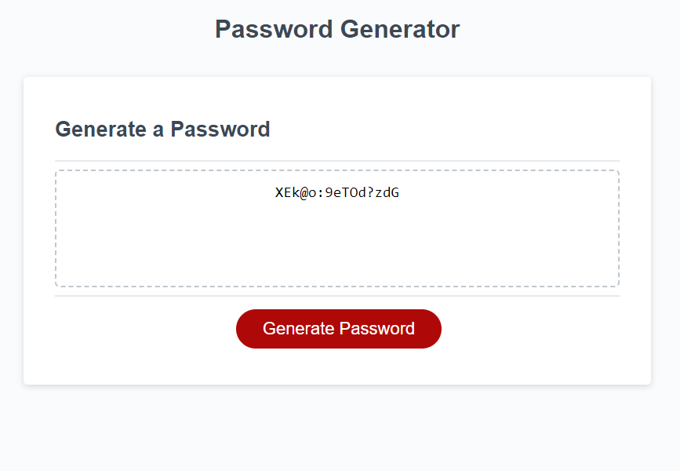

# Password Generator Starter Code

## Description

I wanted to fix this password generator! Not only get it to work correctly effeciently and correctly for the user, but actually validate that the chosen criteria is being met. In this project I learned and applied several JavaScript elements to create functions to make this generator work.

## Usage

Simple, just hit generate! Several prompts will appear in the browser, asking for 4 different character types, then the password will appear in the text box in the window. This password should also be able to be copied easily.

## Credits

I had a lot of help from a fellow classmate, Joshua Taylor. Thanks a ton!

